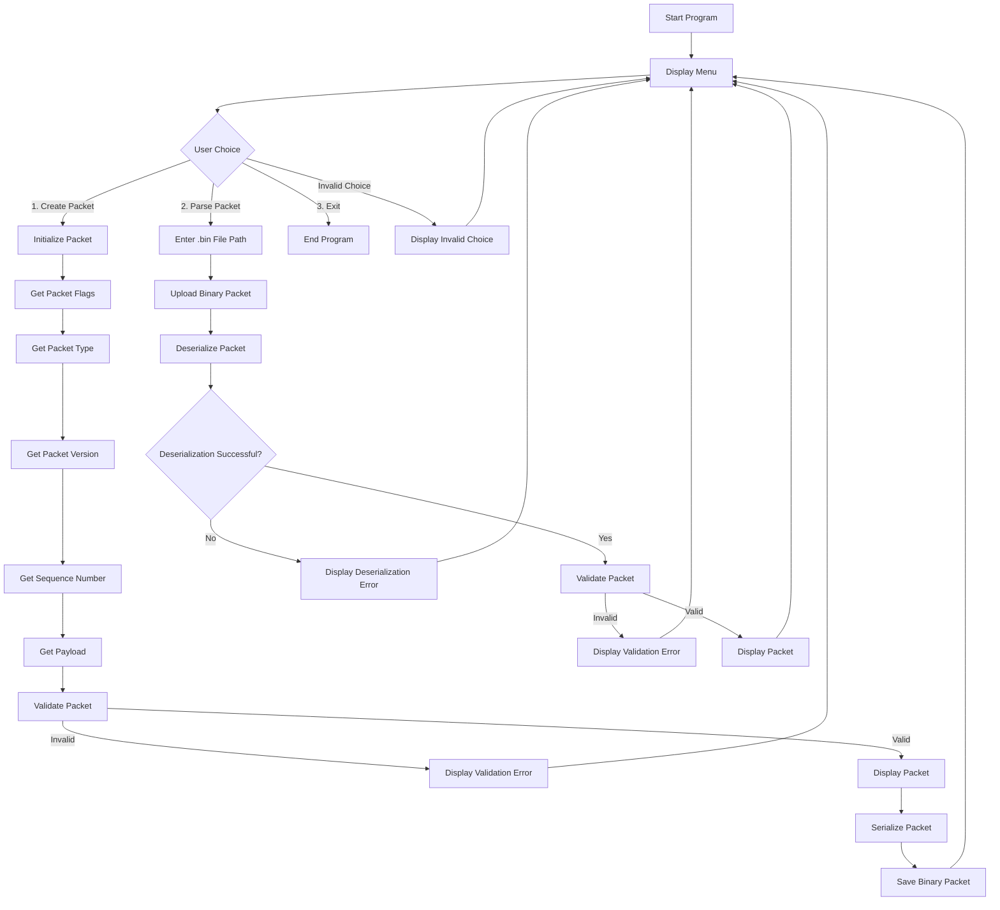
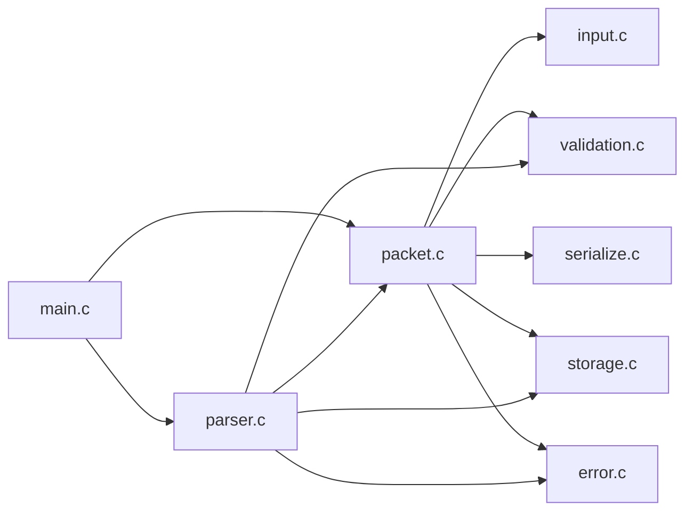

# Mini Packet Analyzer

A modular C-based packet analyzer for creating, validating, serializing, storing, uploading, and parsing custom binary packets.

## Overview

**Mini Packet Analyzer** is a C project that demonstrates how a packet can be constructed from user input, validated according to defined packet rules, serialized into binary data, saved to a `.bin` file, and later uploaded and deserialized for analysis.

The project is organized into separate modules for packet management, input handling, validation, serialization, parsing, storage, and error handling.

## Features

* Create packets interactively from user input
* Support for multiple packet types:

  * DATA
  * ACK
  * ERROR
* Support for packet flags:

  * ACK
  * SYN
  * ERROR
  * PRIORITY
* Packet version and sequence number handling
* Payload handling with a maximum payload size of 1024 bytes
* Packet validation
* Binary packet serialization
* Binary packet deserialization
* Save packets to `.bin` files
* Upload packets from `.bin` files
* Display packet information and validation errors
* Modular source-code organization using header and implementation files

## Control Flow

The following diagram shows the overall control flow of the Mini Packet Analyzer:



## Module Flow



## Project Structure

```text
mini-packet-analyzer/
├── README.md
├── Makefile
├── .gitignore
├── main.c
├── packet.bin
├── include/
│   ├── error.h
│   ├── input.h
│   ├── packet.h
│   ├── parser.h
│   ├── serialize.h
│   ├── storage.h
│   └── validation.h
└── src/
    ├── error.c
    ├── input.c
    ├── packet.c
    ├── parser.c
    ├── serialize.c
    ├── storage.c
    └── validation.c
```

## Module Description

### `main.c`

Provides the program entry point and menu interface.

The user can:

1. Create a packet
2. Parse an existing packet
3. Exit the program

### `packet.c`

Provides the core packet operations:

* Initialize a packet
* Display packet information
* Set and clear flags
* Check packet flags
* Set packet payload
* Build a packet from user input
* Create a packet

### `input.c`

Handles interactive user input including:

* Integer input
* String input
* Packet type selection
* Packet version
* Sequence number
* Packet flags

### `validation.c`

Validates packet fields including:

* Packet version
* Packet type
* Sequence number
* Flags
* Payload length
* Payload consistency
* File extension

### `serialize.c`

Converts packet fields into a binary representation suitable for storage.

### `parser.c`

Reads serialized packet data and reconstructs the `Packet` structure.

### `storage.c`

Handles binary file operations:

* Saving serialized packet data
* Uploading packet data from `.bin` files

### `error.c`

Defines packet validation errors and displays appropriate error messages.

## Packet Structure

The packet is represented using the following fields:

| Field    | Type         | Description            |
| -------- | ------------ | ---------------------- |
| Version  | `uint8_t`    | Packet format version  |
| Type     | `PacketType` | DATA, ACK, or ERROR    |
| Flags    | `uint16_t`   | Packet control flags   |
| Length   | `uint16_t`   | Payload length         |
| Sequence | `uint32_t`   | Packet sequence number |
| Payload  | `char[]`     | Packet data            |

### Packet Types

```text
1 → DATA
2 → ACK
3 → ERROR
```

### Packet Flags

```text
ACK      → 1 << 0
SYN      → 1 << 1
ERROR    → 1 << 2
PRIORITY → 1 << 3
```

## Packet Validation

The project validates packets before they are stored or displayed as valid packets.

Validation includes:

* Version must be `1`
* Packet type must be DATA, ACK, or ERROR
* Sequence number must not be `0`
* At least one flag must be present
* Flags must be compatible with the packet type
* Payload must remain within the configured maximum size
* Stored payload length must match the actual payload length

Validation errors are represented using the `PacketError` enumeration.

## How It Works

### Creating a Packet

```text
User
 │
 ▼
Create Packet
 │
 ├── Enter flags
 ├── Select packet type
 ├── Enter version
 ├── Enter sequence number
 └── Enter payload
 │
 ▼
Validate Packet
 │
 ├── Invalid → Display error
 │
 └── Valid
      │
      ▼
   Serialize
      │
      ▼
   Save as .bin
```

### Parsing a Packet

```text
User
 │
 ▼
Parse Packet
 │
 ▼
Enter .bin file path
 │
 ▼
Upload binary data
 │
 ▼
Deserialize
 │
 ▼
Validate Packet
 │
 ├── Invalid → Display error
 │
 └── Valid → Display packet
```

## Compilation

### Using Make

Build the project with:

```bash
make
```

This compiles the source files and creates the `packet_analyzer` executable.

### Run

```bash
./packet_analyzer
```

### Clean Build Files

```bash
make clean
```

### Build and Run

```bash
make run
```

## Manual Test Cases

### Packet Creation

| # | Test Case                       | Expected Result                            |
| - | ------------------------------- | ------------------------------------------ |
| 1 | Create a valid DATA packet      | Packet is validated, serialized, and saved |
| 2 | Create a valid ACK packet       | Packet is validated and saved              |
| 3 | Create a valid ERROR packet     | Packet is validated and saved              |
| 4 | Enter an invalid packet version | Invalid version error                      |
| 5 | Enter sequence number `0`       | Invalid sequence error                     |
| 6 | Create a packet without flags   | No-flag error                              |
| 7 | Use an invalid flag combination | Appropriate flag validation error          |
| 8 | Enter a valid payload           | Payload is accepted                        |
| 9 | Enter an oversized payload      | Payload validation fails                   |

### File Operations

| # | Test Case                            | Expected Result                 |
| - | ------------------------------------ | ------------------------------- |
| 1 | Save packet using `.bin` extension   | Packet is written to file       |
| 2 | Save using an invalid extension      | File extension validation fails |
| 3 | Upload an existing `.bin` file       | Binary data is read             |
| 4 | Parse valid serialized packet        | Packet is reconstructed         |
| 5 | Parse incomplete/invalid binary data | Deserialization fails           |
| 6 | Parse a packet with invalid fields   | Validation error is displayed   |

## Technologies

* **Language:** C
* **Compiler:** GCC
* **Build System:** Make
* **File Format:** Binary (`.bin`)
* **Development:** Command-line environment

## Concepts Demonstrated

This project demonstrates practical use of:

* C structures
* Enumerations
* Header files
* Modular programming
* Functions and pointers
* Bitwise flag operations
* Binary file I/O
* Serialization and deserialization
* Input handling
* Validation
* Error handling
* Multi-file compilation
* Makefiles

## Build Requirements

The project requires:

* GCC
* GNU Make
* A command-line environment

Check the installed versions:

```bash
gcc --version
make --version
```

## Usage

After building the project:

```bash
./packet_analyzer
```

The application displays:

```text
===== MINI PACKET ANALYZER =====
1. Create Packet
2. Parse Packet
3. Exit
================================
```

Select an option and follow the prompts provided by the program.

## Author

**Sai Kamal Kota**

GitHub: [kota-Saikamal](https://github.com/kota-Saikamal)
